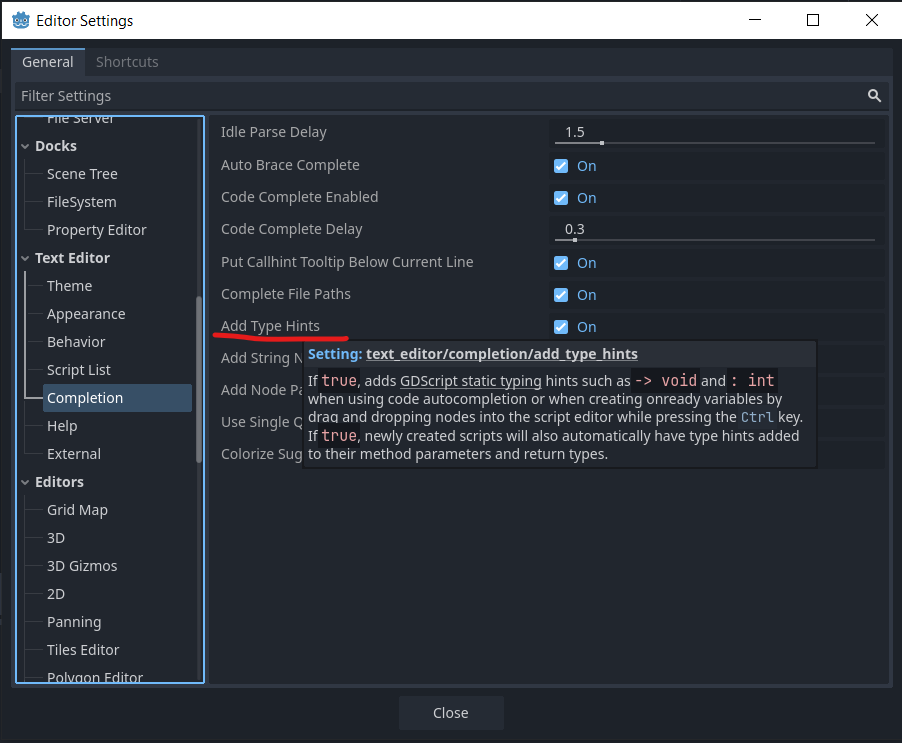
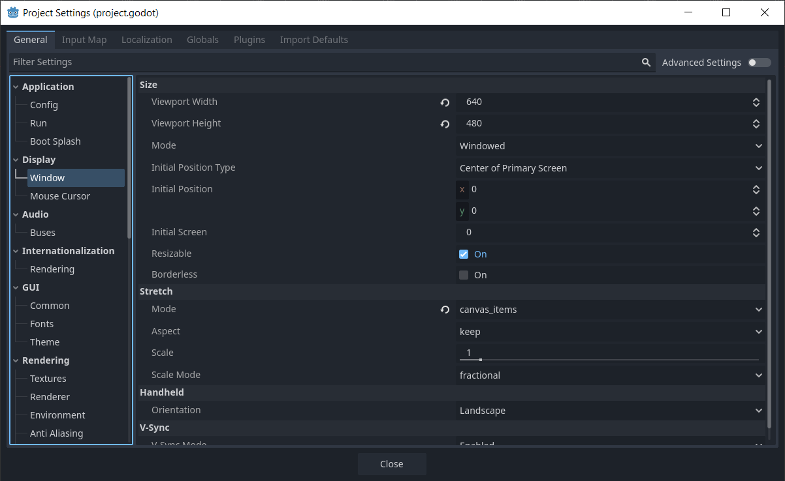
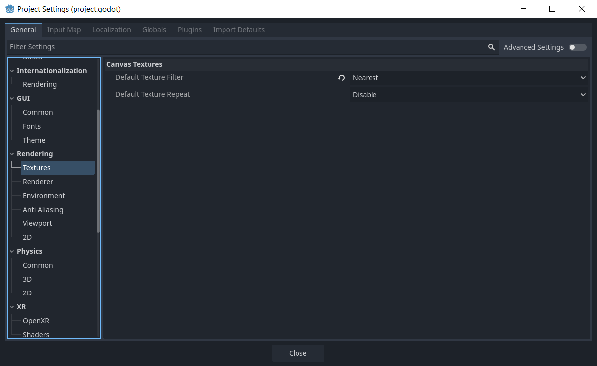

# Godot Crash Course

Godot Version: **4.3**

This course is about create the 2D game(Plaformer) with simple mechanics such as
- Player that can walk, idle, jump, fall and drop down from platform
- Collect all collecable, and go to the goal to finish the stage
- Have the label to display the collectable amount
- Can Pause

# Resourses

Sprite's Source: https://pixelfrog-assets.itch.io/pixel-adventure-1
 
Audio Sources:
	 
	- Musics: https://opengameart.org/content/platformer-game-music-pack
	 
	- Sound Effects: https://opengameart.org/content/8-bit-sound-effects-library

# How To Import Sprites Pixel Art

1. Go to Project > Project Settings... > General > Rendering > Texture
2. Change **Default Texture Filter** from **Linear** to **Nearest**

# How To make internal editor show the type hint

1. Go to Editor > Editor Settings... > Text Editor > Completion
2. Check the **Add Type Hints** box

# Settings in this Project
1. Display > Window
  - W:H → **640 x 480**
	- Stretch:
		- Mode: **canvas_items**

2. Rendering > Textures
  - Canvas Textures
	- Default Texture Filter: **Nearest**

# Branching
1. **start-from-scratch** -> start this project from scratch.
2. **start-prepared** -> start this project with some prepared scenes.
3. **complete** -> complete of this project with example stages
